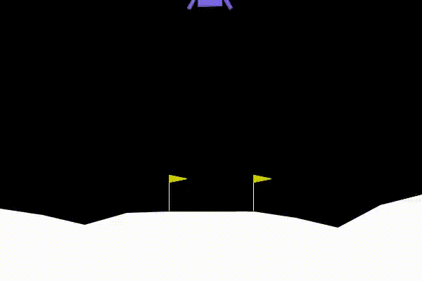
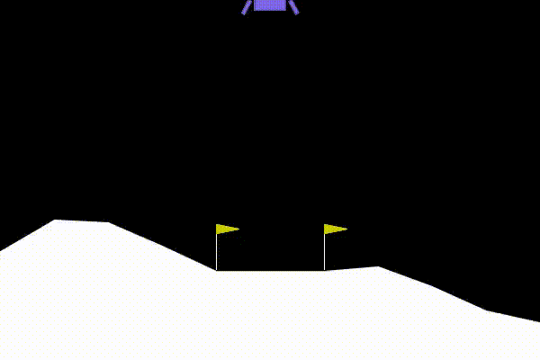

# DQN-LunarLander
The repository contains the script for Deep Q-Learning (DQN) using the Lunar Lander of OpenAI Gym as the environment.

# About the environment
The environment used is the OpenAI gym Lunar-Lander v-2 environment. The goal of the task is to safely land a lunar lander ship within the landing area, the area between two yellow flags. The lunar lander can perform 4 actions.

| Action | Index |
| :---:   | :---: |
| do nothing | 0 |
| fire left orientation engine | 1 |
| fire main engine | 2 |
| fire right orientation engine | 3 |

The position, speed and accleration are monitored in the state variable. The state also contains the boolean variables that signify whether the two legs of the lunar lander is in contact with the ground.

The reward is given based on the speed of the lunar lander, the distance from the landing area, the firing amount, the lander orientation, the amount of time the legs are in contact with the ground, and the success of the landing.

# How to use:
The train.py file trains the DQN algorithm and outputs the weights into the saved_weights directory. The test.py file tests the algorithm with the weights loaded from the saved_weights directory.

# Parameters
episodes = 800

init_epsilon = 0.99

epsilon_decay = 0.996

batch_size = 128

Gamma = 0.99

LR = 1e-4

TAU = 0.005

Network:

    class QNet(nn.Module):

        def __init__(self, n_states, n_actions, seed = 2534554):

            super(QNet, self).__init__()
            torch.manual_seed(seed)
            self.layer1 = nn.Linear(n_states, 400)
            self.layer2 = nn.Linear(400,200)
            self.layer3 = nn.Linear(200, n_actions)

        def forward(self, x):

            x = F.relu(self.layer1(x))
            x = F.relu(self.layer2(x))
            x = self.layer3(x)
            return x

# Video
Before Training:

After Training:

# Results

# Dependencies
-Pytorch

-gymnasium

-swig

-box2d-py

-gymnasium[box2d]

# Sources
Details on LunarLander v-2: https://www.gymlibrary.dev/environments/box2d/lunar_lander/